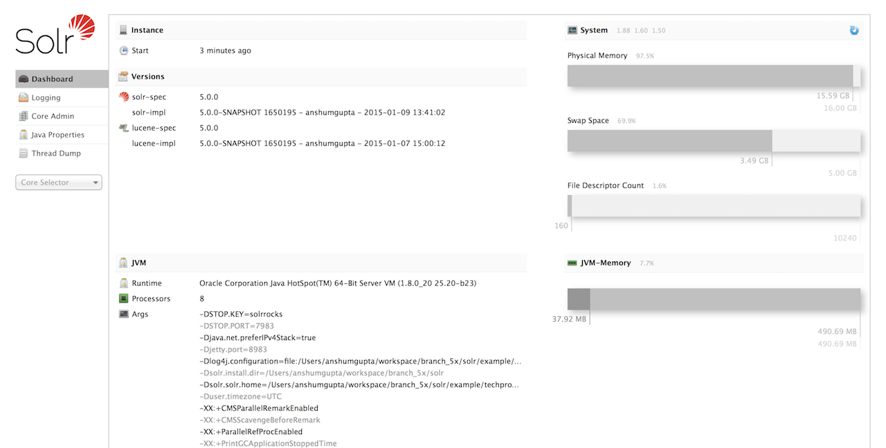
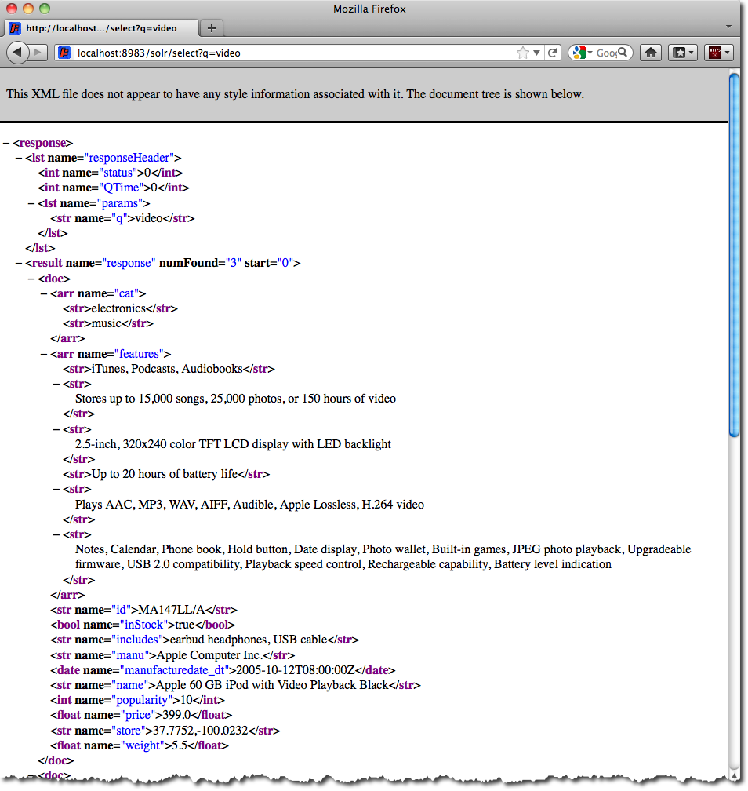

# 1.2. Running Solr

This section describes how to run Solr with an example schema, how to add documents, and how to run queries. 

## start the Server

If you didn't start Solr after installing it , you can start it by running **bin/solr** from the Solr directory.

    $ bin/solr start

If youi are running Windows, you can start Solr by running **bin\solr.cmd** instead.

    bin\solr.cmd start
  
This will start Solr in the background, listening on port 8983.

When you start Solr in the background, the script will wait to make sure Solr starts correctly before returning to the command line prompt.

The **bin/solr** and **bin\solor.cmd** scripts allow you to customize how you start Solr. Let's work through a few examples of using the **bin/solr** script (if youi're running Solr on Windows, the **bin\solr.cmd** works the same as what is shown in the examples below):

### Solr Script Options

The **bin/solr** script has sveral options.

#### Script Help

To see how to use the **bin/solr** script, execute:

    $ bin/solr -help

For Specific usage instructions for the **start** command, do:

    $ bin/solr start -help

#### Start Solr in the Foreground

Since Solr is a server, it is more common to run it in the background, especially on Unix/Linux. However, to start Solr in the foreground, simply do:

    $ bin/solr start -f

If you are running Windows, you can run:

    bin\solr.com start -f

#### Start Solr with a Different Port

To change the prot Solr listens on, you can use the -p parameter when starting, such as:

    $ bin/solr start -p 8984

#### Stop Solr

When running Solr in the foreground (using -f), then you can stop if using Ctrl-c, however, when running in the background, you should use the **stop** command, such as:

    $ bin/solr stop -p 8983

The stop command requires you to spcify the port Solr is listening on or you use the -all parameter to stop all running Solr instances.

#### Start Solr with a Specific Bundled Example

Solr also provides anumber of useful examples to help you learn about key features. You can launch the examples using the -e flag. For instance, to launch the "techproducts" example, you would do:

    $ bin/solr -e techproducts

Currently, the available examples you can run are: techproducts, dih, shemaless, and cloud. See the sectiojn [Running with Example Configurations]() for details on each example.

> <i class="fa fa-info-circle" style="color:#19407c;"></i>**Getting Started With SolrCloud<br/> Running the *cloud* example starts Solr in SolrCloud mode. For more information on starting Solr in cloud mode, see the section [Getting Started with SolrCloud]()

#### Check if Solr is Running

if you're not sure if Solr is running locally, you can use the status command:

    $ bin/solr status

This will search for running Solr instances on your computer and then gather basic information about them, such as the version and memory usage.

That's it! Solr is runnig. If you need convincing, use a Web browser to see the Admin Console.

*http://localhost:8983/solr/*



*Figure 1. The Solr Admin interface*

If Solr is not running, your browser will complain that it cannot connect to the server. Check your port number and try again.

## Create a Core

If you did not start Solr with an example configuration, you would need to create a core in order to be able to index and search. You can do so by running:

    $ bin/solr create -c <name>

This will create a core that uses a data-driven schema which tries to guess the correct field type when you add documents to the index.

To see all available options for createing a new core, execute:

    $ bin/solr create -help

## Add Cocuments

Solr is built to find documents that match queries. Solr's schema provides an idea of how content is structured (more on the schema later), but without documents there is nothing to find. Solr needs input before it can do much.

You may want to add a few sample documents before trying to index your own content. The Solr installation comes with different types of example documents located under the sub-directories of the **example/** directory of your installation.

In the **bin/** directory is the post scritp, a command line tool which can be used to index different types of documents. Do not worry too much about the details for now. The [Indexing and Basic Data Operations]() section has all the details on indexing.

To see som infomation about the usage of **bin/post**, use the **-help** option. Windows users, see the section for [Post Tool on Windows]().

**bind/post** can post varous types of content to Solr, including files in Solr's native XML and JSON formats, CSV files, a directory tree of rich documents, or even a simple short web crawl. See the example at the end of `bin/post -help` for varous commands to easily get started posting your content into Solr.

Go ahead and add the documents in some example XML files:

```
$ bin/post -c gettingstarted example/exampledocs/*.xml
SimplePostTool version 5.0.0
Posting files to [base] usr http://localhost:8983/solr/gettingstarted/update...
Entering auto mode. File endings considered are xml, json, csv, pdf, doc, docs, ppt, pptx, xls, xlsx, odt, odp, ods, ott, otp, ots, rtf, htm, html, txt, log
POSTing file gb18030-example.xml (application/xml) to [base]
POSTing file hd.xml (application/xml) to [base]
POSTing file ipod_video.xml (application/xml) to [base]
POSTing file manufacturers.xml (application/xml) to [base]
POSTing file mem.xml (application/xml) to [base]
POSTing file money.xml (application/xml) to [base]
POSTing file monitor.xml (application/xml) to [base]
POSTing file monitor2.xml (application/xml) to [base]
POSTing file mp500.xml (application/xml) to [base]
POSTing file sd500.xml (application/xml) to [base]
POSTing file solr.xml (application/xml) to [base]
POSTing file utf8-example.xml (application/xml) to [base]
POSTing file vidcard.xml (application/xml) to [base]
14 files indexed.
COMMITting Solr index changes to http://localhost:8983/solr/gettingstarted/update...
Time spent: 0:00:00.153
```

That's it! Solr has indexed the document contained in those files.

## Ask Questions

Now that you have indexed documents, you can perform queries. The simplest way is by building a URL that includes the query parameters. This is exactly the same as building any other HTTP URL.

For example, the following query searches all document fields for "video":

    http://localhost:8983/solr/gettingstarted/select?q=video

Notice how the URL includes the host name (localhost), the port number where the server is listening(8983), the application name (solr), the request handler for quiries (select), and finally, the query itself (q=video).

The results are contained in an XML document, which you can examine directly by clicking on the link above. The document contains two parts. The first part is the **responseHeader**, which contains information about the resonse itself. The main part of th reply is in the result tag, which contains one or more doc tags, each of which contains fields from documents that match the query. You can use standard XML transformation techniques the results in JSON, PHP, RUBY and even user-defined formats.

Just in case you are not running Solr as you read, the following screen shot shows the result of a query (the next example, actually) as viewed in Mozilla Firefox. The top-level response contains a **1st** named **responseHeader** and a reslut named response. Inside result, you can see the three docs that represent the search results. 



Figure 2. An XML response to a query.

Once you have mastered the basic idea of a query, it is easy to add enhancements to explore the query syntax. This one is the same as before but the results only contain the ID, name, and preice for each returned document. If you don't specify which fields you want, all of the are returned.

    http://localhost:8983/solr/gettingstarted/select?q=view&fl=id,name,price

Here is another example which searches for "black" in the name field only. If you do not tell Solr which field to search, it will search default fields, as specified in the schema.

    http://localhost:8983/solr/gettingstarted/select?q=name:black

You can provide ranges for fields. The following query finds every document whose price is between $0 and $400

    http://localhost:8983/solr/gettingstarted/select?q=price:0%20TO%20400&fl=id,name,price

[Faceted browsing](http://lucene.apache.org/solr/guide/6_6/faceting.html#faceting) is one of Solr's key features. It allows users to narrow search results in ways that are meaningful to your application. For example, a shopping iste could provde facets to narrow search results by manufactureer or price.

Faceting information is returned as a third part of Solr's query response. To get a taste of this power, take a look at the following query, It adds `facet=true` and `facet.field=cat`.

    http://localhost:8983/solr/gettingstarted/select?q=price:0%20TO%20400&fl=id,name,price&facet=true&facet.field=cat

In addition to the familiar `responseHeader` and response from Solr, a `facet_counts` element is also present. Here is a view with the `responseHeader` and response collapsed so you can see the faceting information clearly.

#### An XML Response with faceting

```xml
<response>
<lst name="responseHeader">
...
</lst>
<result name="response" numFound="9" start="0">
  <doc>
    <str name="id">SOLR1000</str>
    <str name="name">Solr, the Enterprise Search Server</str>
    <float name="price">0.0</float></doc>
...
</result>
<lst name="facet_counts">
  <lst name="facet_queries"/>
  <lst name="facet_fields">
    <lst name="cat">
      <int name="electronics">6</int>
      <int name="memory">3</int>
      <int name="search">2</int>
      <int name="software">2</int>
      <int name="camera">1</int>
      <int name="copier">1</int>
      <int name="multifunction printer">1</int>
      <int name="music">1</int>
      <int name="printer">1</int>
      <int name="scanner">1</int>
      <int name="connector">0</int>
      <int name="currency">0</int>
      <int name="graphics card">0</int>
      <int name="hard drive">0</int>
      <int name="monitor">0</int>
    </lst>
  </lst>
  <lst name="facet_dates"/>
  <lst name="facet_ranges"/>
</lst>
</response>
```

The facet information shows how many of the query results have each possible value of the `cat` field. You could easily use this information to provide users with a quick way to narrow their query results. You can filter results by adding one or more filter queries to the Solr request. This request constrains documents with a category of "software"

    http://localhost:8983/solr/gettingstarted/select?q=price:0%20TO%20400&fl=id,name,price&facet=true&facet.field=cat&fq=cat:software

