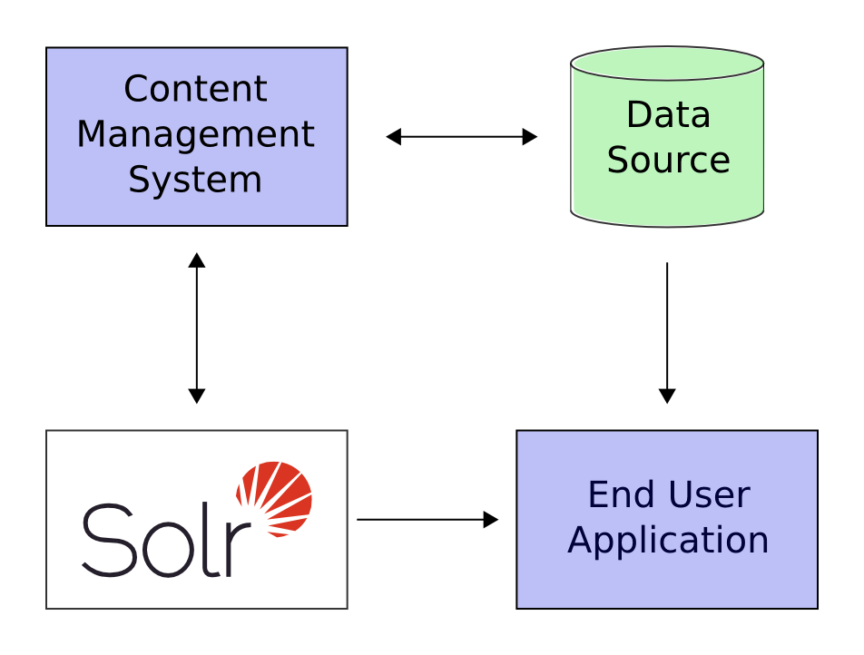

# 1.3. A Quick Overview

Having had some fun with Solr, you will now learn about all the cool things it can do.

Here is a example of how Solr might be integrated into an application:

**Figure 1. Solr integration with application**

In the scenario above, Solr runs along side other server applications. For example, an online store application would provide a user interface, a shopping cart, and a way to make pruchases for end users; while an inventory management application would allow store employees to edit product information. The product metadada would be kept in some kind of database, as weel as in Solr.

Solr makes it easy to add the capability to search through the online store through the following steps:

1. Define a *schame*. The schema tells Solr about the contents of documents it will be indexing. In the online store example, the schema would define fields for the product name, description, price, manufacturer, and so on. Solr's schema is powerful and flexible and allows you to tailor Solr's behavior to your application. See [Documents fields, and Schema Design](http://lucene.apache.org/solr/guide/6_6/documents-fields-and-schema-design.html#documents-fields-and-schema-design) for all the details.
2. Deploy Solr.
3. Feed Solr docuemnts for which your users will search.
4. Expose search functionality in your application.

Because Solr is based on open standards, it is highly extensible. Solr queris are RESTful, which means, in essence, that a query is a simple HTTP request URL and the response is a structured document: mainly XML, but it could also be JSON, CSV, or some other format. This means that a wide variety of clients will be able to use Solr, from other web applications to browser clients, rich client applications, and mobile devices. Any platform capable of HTTP can talk to Solr. See [Client APIs]() for details on client APIs.

Solr is based on the Apache Lucene project, a high-perfomance, full-featured search engine. Solr offers support for the simplest keyword searching through to complex queries on multiple fields and faceted search results. [Searching]() has more information about seraching and queries.

If Solr's capabilitis are not impresive enough, its ability to handle very high-volume applications should do the trick.

A relatively common scenario is that you have so much data, or so many queries, that a single Solr server is unable to handle your entir workload. In this case, you can scale up the capabilities of your application using [SolrCloud]() to better distribute the data, and the processing of requests, across many servers. Multiple options can be mixed and matched depending on the type of scalability you need.

For example: "Sharding" is a scaling technique in which a collection is split into multiple logical pieces called "shards" in order to scale up the number of documents in a collection beyond what could physically fit on a single server. Incoming queries are distributed to every shard in the collection, which respond with merged results. Another technique available is to increase the "Replication Factor" of your collection, which allows your to add servers with additional copies of your collection to handle higher concurrent query load by spreading the requests around to multiple machines. Sharding and Replication are not mutually exclusive, and together make Solr an extremely powerful and scalable platform.

Best of all, this talk about high-volume applications is not just hypothetical: some of the famous Internet sites that use Solr today are Macy's EBay, and Zappo's.

For more information, take a look at [https://wiki.apache.org/solr/PublicServers](https://wiki.apache.org/solr/PublicServers)

